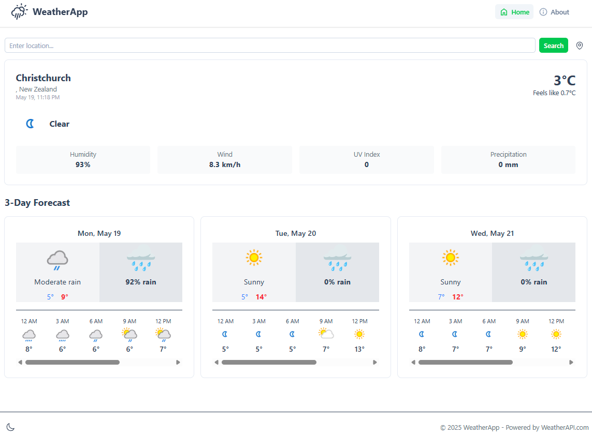
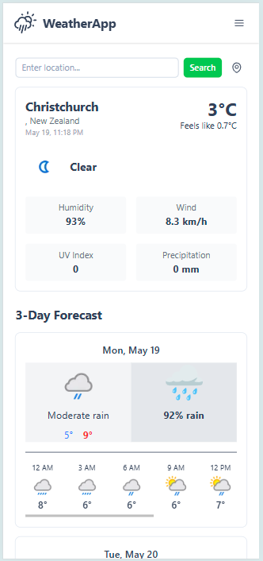

# Weather-App

A lightweight, fully responsive weather forecast viewer built with Vue 3, Nuxt 3, Tailwind CSS and the OpenWeatherMap API.
Featuring a built-in light/dark mode toggle (persists to `localStorage` & respects your OS preference), mobile-first design and zero-build-step deployment.

## 🔗 Links

- Repository: https://github.com/jericrealubit/weather-app
- Live demo: https://weather-jeric.netlify.app/

## 📸 Screenshot

| Desktop                                              | Mobile                                              |
| ---------------------------------------------------- | --------------------------------------------------- |
|  |  |

## ⚡ Features

- Vue 3 + Nuxt 3 (Composition API / Nitro server)
- Tailwind CSS with `dark:` variants for theming
- Light/dark mode toggle
  - Persists user choice in `localStorage`
  - Falls back to system `prefers-color-scheme`
  - Avoids flash-of-unstyled-content via Nuxt Color Mode
- Fetches & caches weather data by city name, coordinates or ZIP
- Displays:
  - Current temperature & feels-like
  - Humidity, wind speed, UV index, precipitation
  - 3-day forecast with hourly scroller
- Mobile-first, responsive grid layouts
- Zero-config deployment on Netlify, Vercel, etc.

## 🛠️ Technologies Used

- **Framework:** [Nuxt 3](https://nuxt.com/) (`nuxt`)
- **UI Library:** [Vue 3](https://vuejs.org/) (`vue`, `vue-router`)
- **Component Library:** [Nuxt UI](https://ui.nuxt.com/) (`@nuxt/ui`)
- **Icons:** [Nuxt Icon](https://nuxt.com/modules/icon) (`@nuxt/icon`) with [Heroicons](https://heroicons.com/) (`@iconify-json/heroicons`)
- **Language:** [TypeScript](https://www.typescriptlang.org/) (`typescript`)
- **Package Manager:** (Assumed npm, but can be yarn or pnpm)

## 🚀 Getting Started

### Prerequisites

- An [OpenWeatherMap API key](https://openweathermap.org/api)
- [Node.js](https://nodejs.org/) (v18.x or newer recommended)
- [npm](https://www.npmjs.com/), [yarn](https://yarnpkg.com/), or [pnpm](https://pnpm.io/)

### Installation

```bash
# 1. Clone repo
git clone https://github.com/jericrealubit/weather-app.git
cd weather-app

# 2. Install dependencies
npm install
# or
yarn install

# 3. Add your API key
# create a `.env` file in project root:
echo "OWM_API_KEY=your_api_key_here" > .env

# 4. Run in development
npm run dev

# or
yarn dev
```

Visit http://localhost:3000 in your browser.

Building & Preview

```bash
# Build production assets
npm run build

# Preview locally
npm run preview
```

⚙️ Configuration
All runtime config options live in nuxt.config.ts. You can override via environment variables:

```bash
export default defineNuxtConfig({
  runtimeConfig: {
    public: {
      owmApiKey: process.env.OWM_API_KEY || ''
    }
  }
})
```

Within your app you can access the key via:

```bash
const config = useRuntimeConfig()
const apiKey = config.public.owmApiKey
```

🖥️ Usage
Search by typing any city name (e.g. "London") or ZIP/postal code.
Geolocation button to fetch weather at your current location (if you grant permission).
Toggle between light & dark using the button at the bottom (or header).
All data is fetched via the OpenWeatherMap REST endpoints and cached in memory until page refresh.

📦 Deployment
This is a fully static-ready Nuxt 3 site—just push to Netlify, Vercel, or any static host:

Link your GitHub repo in your hosting dashboard.
Set environment variable OWM_API_KEY.
Build command: npm run build
Publish directory: .output/public

🤝 Contributing
Contributions, issues and feature requests are welcome! Please:

Fork the project
Create your feature branch (git checkout -b feat/YourFeature)
Commit your changes (git commit -m 'feat: add SomeFeature')
Push to the branch (git push origin feat/YourFeature)
Open a Pull Request`

📝 License
This project is open source under the MIT License.
